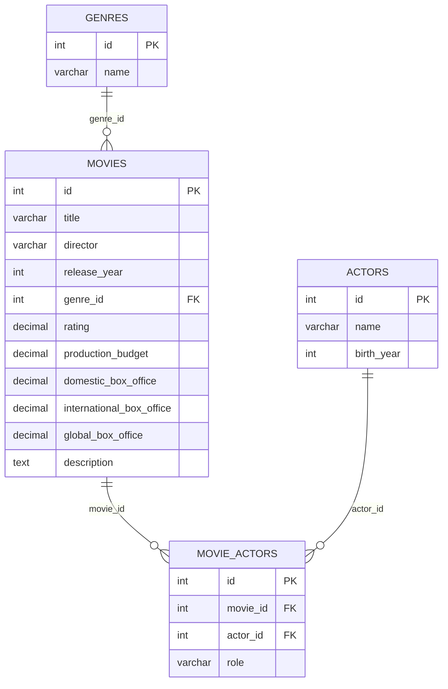

# Natural Language Movie Database Query Application

A cutting-edge web application that enables users to query a MariaDB movie database using natural language, powered by Docker's Model Runner for local LLM inference.

## Features

- 🎬 Natural language querying of a movies database
- 🤖 Local LLM inference using Docker Model Runner
- 🗄️ MariaDB database with demo movie data
- 🔄 Live schema introspection directly from MariaDB on every query
- 🔀 Runtime selection between multiple locally hosted LLMs
- 🌐 Modern web interface with FastAPI backend
- 🐳 Fully containerized with Docker Compose

## Prerequisites

- Docker Desktop 4.40 or later (with Model Runner feature)
- Docker Compose
- Internet connection (for initial model pull)

## Setup Instructions

### 1. Enable Docker Model Runner

1. Open Docker Desktop
2. Navigate to **Settings** > **AI**
3. Enable **Docker Model Runner**
4. (Optional) Enable **GPU-backed inference** for better performance

### 2. Pull a Language Model

Before starting the application, pull a model using Docker Model Runner:

```bash
docker model pull ai/smollm2:360M-Q4_K_M
```

This will download a lightweight model suitable for local inference. You can also use other models from the Docker Model registry.

### 3. Start the Application

Navigate to the project directory and start all services:

```bash
docker compose up --build
```

This will:
- Start the MariaDB database with demo movie data
- Build and start the FastAPI web application
- Initialize the database with schema and sample data

### 4. Access the Application

Open your web browser and navigate to:

```
http://localhost:8000
```

## Usage

### Example Queries

Try asking questions in natural language:

- "What movies did Tom Hanks star in?"
- "Show me all action movies from 2000"
- "Which movies have a rating above 8.5?"
- "List all movies directed by Christopher Nolan"
- "What are the top 5 highest rated movies?"
- "Show me movies released in 1994"

### Choosing an LLM Model

The UI now exposes a dropdown that lists every model Docker Model Runner injects
into the container (via the `models` section of `compose.yaml`). Pick the model
you want per request—great for quickly comparing output quality or latency.

### API Endpoints

#### POST `/api/query`

Submit a natural language query to the database.

**Request:**
```json
{
  "query": "What movies did Tom Hanks star in?",
  "model": "gptoss"
}
```
(Omit `model` to use the default configured model.)

**Response:**
```json
{
  "natural_language_query": "What movies did Tom Hanks star in?",
  "sql_query": "SELECT m.title, m.release_year FROM movies m JOIN movie_actors ma ON m.id = ma.movie_id JOIN actors a ON ma.actor_id = a.id WHERE a.name = 'Tom Hanks'",
  "results": [
    {
      "title": "Forrest Gump",
      "release_year": 1994
    },
    ...
  ],
  "error": null
}
```

#### GET `/api/health`

Check the health status of the application and database connection.

#### GET `/api/models`

Returns the list of model identifiers currently available for selection in the
UI. This is populated automatically from the environment variables Docker Model
Runner injects for each configured model in `compose.yaml`.

## Architecture

### Components

1. **MariaDB Database** (`mariadb` service)
   - Stores movie data (movies, actors, genres, relationships)
   - Initialized with demo data on first startup
   - Persistent volume for data storage

2. **FastAPI Backend** (`webapp` service)
   - REST API for handling queries
   - Integrates with Docker Model Runner for LLM inference
   - Executes SQL queries against MariaDB
   - Serves the HTML frontend

3. **Docker Model Runner**
   - Runs locally (not in Docker Compose)
   - Provides OpenAI-compatible API endpoint
   - Converts natural language to SQL queries

### Database Schema

The backend queries `INFORMATION_SCHEMA` on each request, so the LLM always sees
the actual tables/columns currently present in MariaDB. The default demo data
includes the following tables:

- **genres**: Movie genres (Action, Drama, etc.)
- **movies**: Movie information (title, director, year, rating, etc.)
- **actors**: Actor information (name, birth year)
- **movie_actors**: Junction table linking movies to actors

#### Visual Overview



## Configuration

### Environment Variables

The application uses the following environment variables (set in `compose.yaml`):

- `DATABASE_HOST`: MariaDB host (default: `mariadb`)
- `DATABASE_PORT`: MariaDB port (default: `3306`)
- `DATABASE_USER`: Database user (default: `user`)
- `DATABASE_PASSWORD`: Database password (default: `password`)
- `DATABASE_NAME`: Database name (default: `movies_db`)
- `LLM_URL`: Docker Model Runner API endpoint (set automatically by Docker Model Runner)
- `LLM_MODEL`: Model identifier (set automatically by Docker Model Runner)
- `LLM_TEMPERATURE`: Temperature for LLM inference (default: `0.1`)
- `LLM_TIMEOUT`: Timeout for LLM requests in seconds (default: `120`)
- `LLM_SUMMARY_ROW_LIMIT`: Maximum rows to include in natural language summaries (default: `15`)

### Model Runner Configuration

The Model Runner configuration is handled automatically by Docker Compose through the `models` section in `compose.yaml`. The model and API endpoints (`LLM_URL` and `LLM_MODEL`) are automatically injected as environment variables into the webapp container. The default model is `ai/gpt-oss` as specified in `compose.yaml`, but you can modify this in the compose file.

## Troubleshooting

### Model Runner Not Responding

1. Ensure Docker Model Runner is enabled in Docker Desktop settings
2. Verify the model is pulled: `docker model ls`
3. Check if Model Runner is running: The API should be accessible at `http://localhost:12434`
4. Verify the `LLM_URL` and `LLM_MODEL` environment variables are set correctly (they should be set automatically by Docker Compose)

### Database Connection Issues

1. Check if MariaDB container is running: `docker ps`
2. Verify database credentials in `compose.yaml`
3. Check container logs: `docker compose logs mariadb`

### SQL Generation Errors

- The LLM may sometimes generate invalid SQL
- Try rephrasing your query
- Check the generated SQL in the results to see what was executed
- Only SELECT queries are allowed for security

## Development

### Project Structure

```
.
├── compose.yaml            # Service orchestration
├── init.sql                # Database schema and demo data
├── README.md               # This file
└── app/
    ├── Dockerfile          # Application container
    ├── main.py             # FastAPI application
    ├── requirements.txt    # Python dependencies
    └── static/
        ├── index.html      # Frontend interface
        └── style.css       # Styling
```

### Running in Development Mode

For development with hot-reload:

```bash
docker compose up mariadb
# Then run locally:
cd app
pip install -r requirements.txt
uvicorn main:app --reload --host 0.0.0.0 --port 8000
```

## Security Notes

- Only SELECT queries are allowed for security
- Database credentials should be changed in production
- Model Runner should be properly secured in production environments
- Consider adding authentication/authorization for production use

## License

This is a demo application for educational purposes.

## Contributing

This is a demonstration project. Feel free to fork and modify for your own use.

