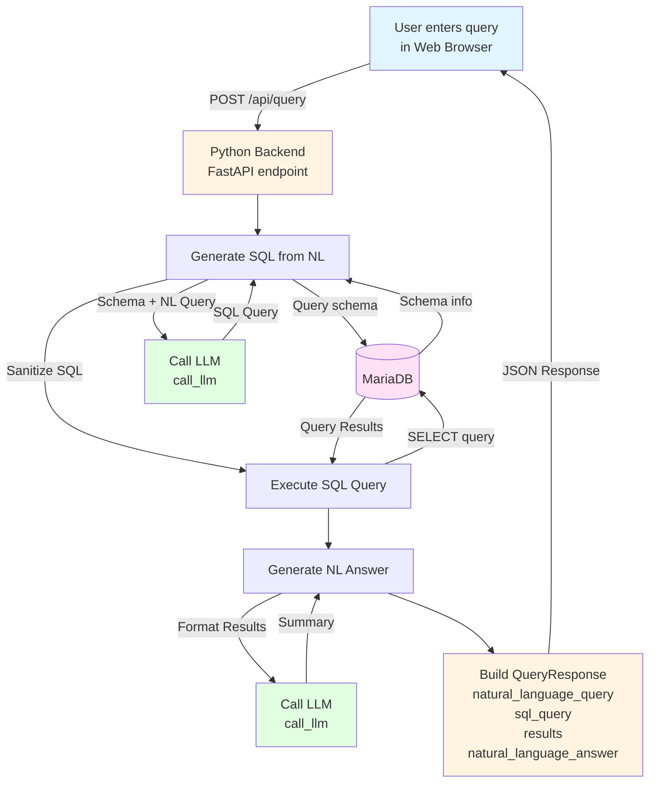

# Workflow Diagram

```mermaid
flowchart TD
    A[User enters query<br/>in Web Browser] -->|POST /api/query| B[Python Backend<br/>FastAPI endpoint]
    
    B --> D[Generate SQL from NL]
    
    D -->|Query schema| F[(MariaDB)]
    F -->|Schema info| D
    
    D -->|Schema + NL Query| G[Call LLM<br/>call_llm]
    G -->|SQL Query| D
    D -->|Sanitize SQL| H[Execute SQL Query]
    
    H -->|SELECT query| F
    F -->|Query Results| H
    
    H --> I[Generate NL Answer]
    I -->|Format Results| J[Call LLM<br/>call_llm]
    J -->|Summary| I
    
    I --> K[Build QueryResponse<br/>natural_language_query<br/>sql_query<br/>results<br/>natural_language_answer]
    
    K -->|JSON Response| A
    
    style A fill:#e1f5ff
    style B fill:#fff4e1
    style F fill:#ffe1f5
    style G fill:#e1ffe1
    style J fill:#e1ffe1
    style K fill:#fff4e1
```
